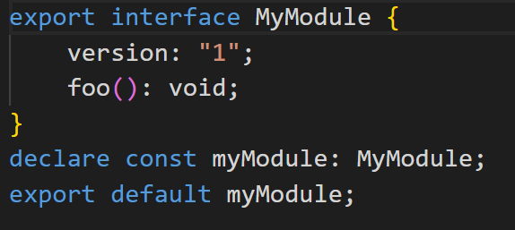
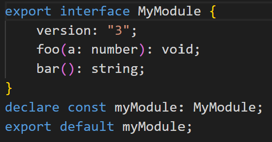
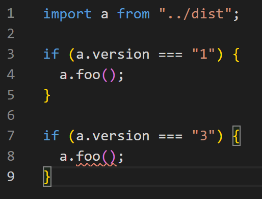
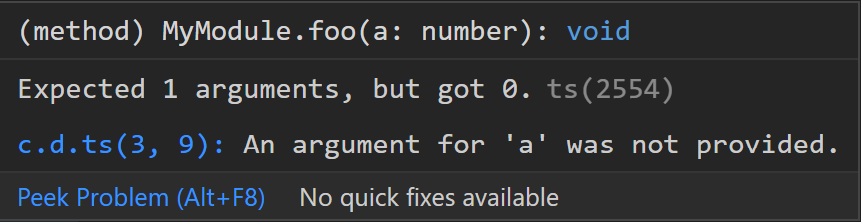

# merge-types

playground for fiddling with runtime type merging

# How to

```
> npm install
> npm run build
```

Open up `consumer.ts` in VSCode (running a TS Server) to see how the compile-time type checking manifests.

## V1 Type Definition



## V3 Type Definition



## Runtime version checking



